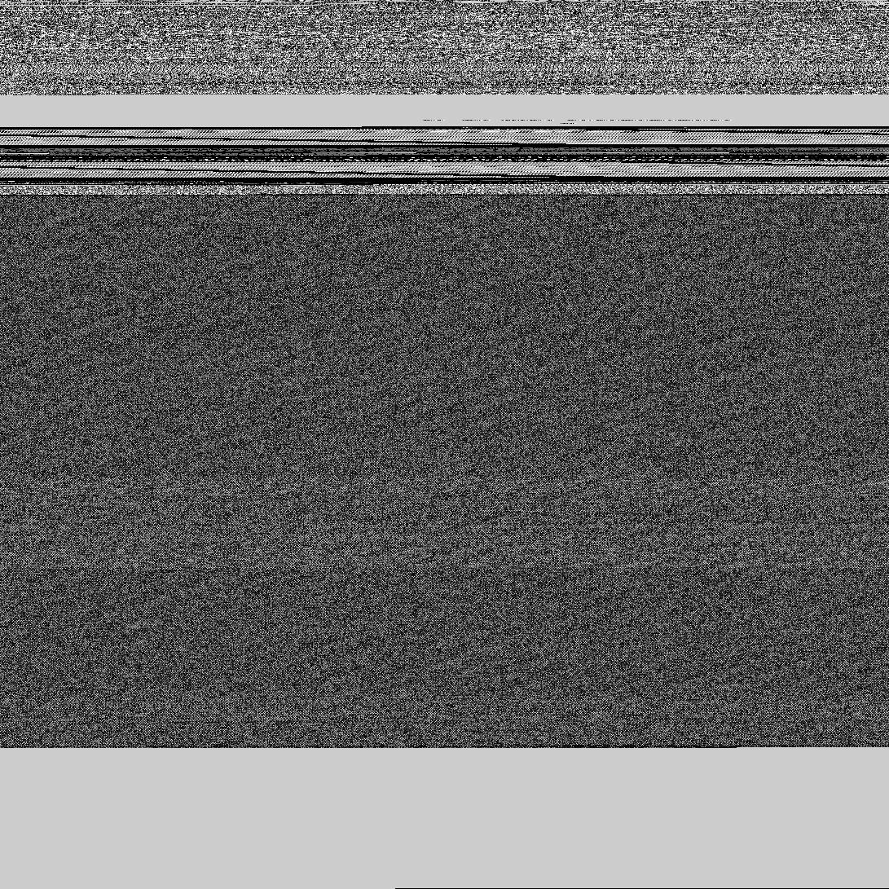
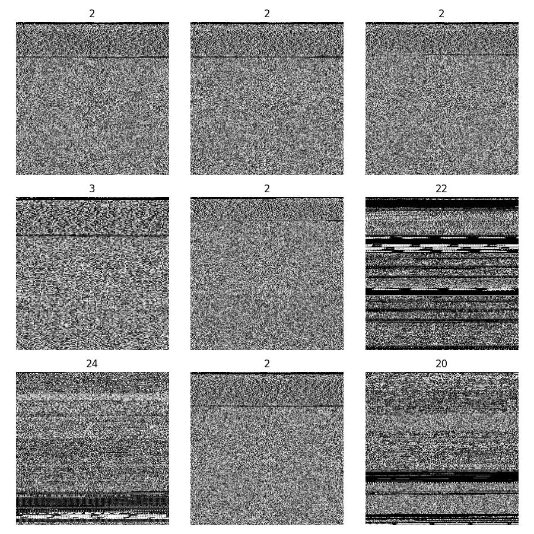
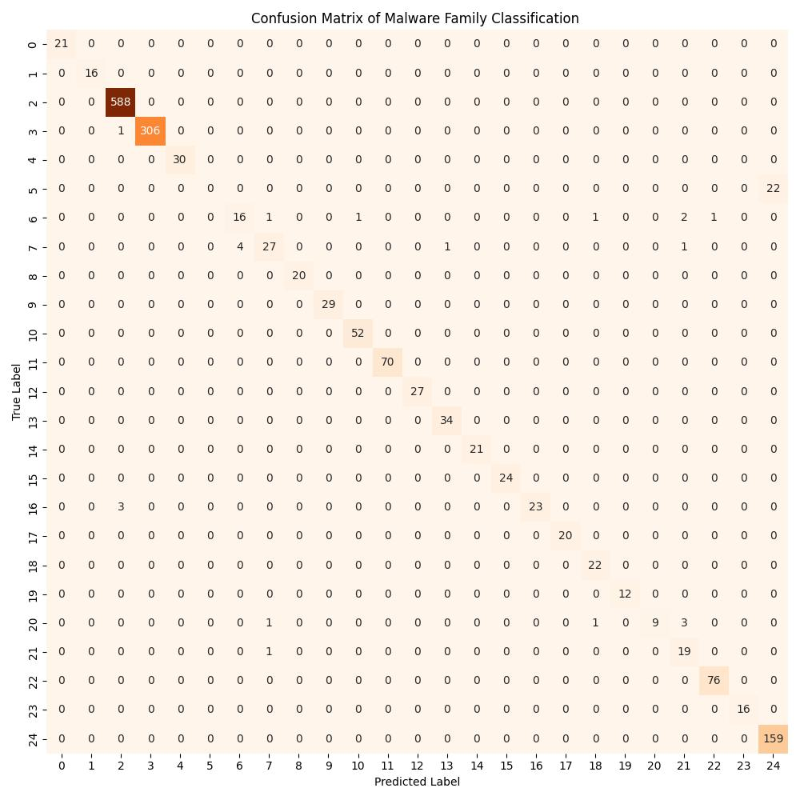

# <u>Prince Garin’s Curse:</u> Malware Family Classification with CNNs

Malware classification is a critical aspect of cybersecurity, as it enables security professionals to identify, analyze, and mitigate various types of malicious software that threaten the digital landscape. By classifying malware based on its behavior, characteristics, and attack techniques, experts can devise more effective defense strategies to protect valuable information and systems. Malware family classification, on the other hand, is the process of grouping similar malware samples into families based on shared attributes, such as code structure, function, or origin. This approach facilitates the development of targeted countermeasures for specific families, allowing for a more focused and efficient response to emerging threats. Both malware classification and malware family classification are essential components in the ongoing battle against cybercrime, providing a foundation for the development of cutting-edge security solutions.

Signatures were once the primary method for malware classification, relying on unique patterns or sequences of bytes present in the malicious code to identify and categorize threats. However, with the growing sophistication of malware and the increased use of obfuscation techniques, signature-based detection has become less effective in countering novel and evolving threats.

To overcome these limitations, researchers have turned to image-based classification techniques. By converting malware binaries or code sequences into visual representations, such as grayscale images, these techniques leverage the power of machine learning and artificial intelligence to classify malware based on the patterns and structures present in the images. This approach allows for a more comprehensive and robust classification process, as it can detect similarities and variations in the images that might not be evident through traditional signature-based methods.

This sandbox demonstrates the training of a malware family classifier using a convolutional neural network and the Malimg dataset. Please see the outline below to jump to related sections.

1. Creating Grayscale Images from Malware
2. The Malimg Dataset and Prepping the Data
3. The Convolutional Neural Network
4. Training the Model
5. Evaluating the Trained Classifier


---

## 1. Creating Grayscale Images from Malware

The process of converting malware into grayscale images typically involves transforming the binary or code sequences of the malicious software into a visual representation. First, the malware sample is disassembled or decompiled to obtain its raw byte sequence. Next, these byte values are converted to their corresponding decimal values (i.e., 8D = 141). These decimal values are then mapped onto a two-dimensional grid, with each value representing a pixel in the grayscale image.The following code demonstrates this process. The byte file used in this example is from the Microsoft Malware Classification Challenge (BIG 15) data sample zip → *dataSample.7z,* which can be found in the **Resources** at the bottom of the page.

```python
import os
import numpy as np
from PIL import Image

def byte_to_img(byte_path, img_path, resize=None):
    """
    Convert a byte file to a grayscale image.
    
    Parameters
    ----------
    byte_path: str
        Path to a byte file
    img_path: str
        Path to saved image file
    """
    # opens the byte file and reads the contents
    with open(byte_path, mode="rb") as zip_file:
        contents = zip_file.read()
    # convert to a string. Makes it easier to remove newlines and spaces
    s = contents.decode('utf-8').lower()
    # remove new lines characters
    s = s.split("\r\n")
    # remove spaces
    byte = [item for line in s for item in line.split(" ")]
    # convert to decimal value
    byte_vals = [int(i, 16) for i in byte if len(i) == 2 and i != "??"]
    # find image size and update to get data right length
    im_size = int(np.sqrt(len(byte_vals)))
    while im_size*im_size < len(byte_vals):
        im_size += 1
    while len(byte_vals) < im_size*im_size:
        byte_vals.append(0)
    # convert to numpy array and reshape
    byte_vals = np.reshape(byte_vals, (im_size, im_size)).astype(np.uint8)
    
    # make the image and save
    img = Image.fromarray(byte_vals, mode='L')
    if resize != None:
        img = img.resize((resize, resize))
    name = img_path+".jpg" if "." not in img_path else img_path
    img.save(name)
    img.show()

file_name = "dataSample/0A32eTdBKayjCWhZqDOQ.bytes"
save_name = "mal_gray_ex.jpg"
resize = 256

byte_to_img(file_name, save_name, resize)
```

The resulting grayscale image looks like:



## 2. The Malimg Dataset and Prepping the Data

In this project, we will be using the Malimg dataset, which is a well-known dataset used for malware classification research, particularly in the context of image-based classification techniques. It consists of grayscale images generated from malware samples belonging to 25 different families.

1. Download the Malimg Dataset from Kaggle: 

[malimg_dataset9010](https://www.kaggle.com/datasets/keerthicheepurupalli/malimg-dataset9010/code)

1. Load the Data

```python
from keras.preprocessing.image import ImageDataGenerator
from sklearn.model_selection import train_test_split

# generate dataset
path = "malware_data/train" # path to the train folder of the malimg dataset
# load images of size target = (64, 64)
batches = ImageDataGenerator().flow_from_directory(directory=path, color_mode='grayscale', target_size=(256,256), batch_size=10000)
# Since batchsize (10000) > # of imgs, this next line returns all imgs and labels
imgs, labels = next(batches)
# Create training and testing sets
X_train, X_test, y_train, y_test = train_test_split(imgs, labels, test_size=0.2)
```

1. Visualize Some of the Malware Images

```python
import matplotlib.pyplot as plt

fig, ax = plt.subplots(3, 3, figsize=(9, 9))

for i in range(3):
    for j in range(3):
        ax[i, j].imshow(imgs[i*3+j], cmap='gray')
        ax[i, j].set_axis_off()
        ax[i, j].set_title(labels[i*3+j].argmax())
        
fig.tight_layout()
plt.savefig("Malware_vis.jpg")
plt.show()
```



## 3. The Convolutional Neural Network

A convolutional neural network (CNN) uses filter matrices over the input data to extract local features from the input. The CNN architecture is shown in the code below.

```python
import tensorflow as tf
from tensorflow.keras import layers, Model

class VanillaCNN(Model):
    def __init__(self, im_size=64, channels=1, num_classes=25):
        super(VanillaCNN, self).__init__()

        self.conv1 = layers.Conv2D(32, kernel_size=(3, 3), activation='relu', input_shape=(im_size, im_size, channels))
        self.conv2 = layers.Conv2D(64, kernel_size=(3, 3), activation='relu')
        self.max_pool = layers.MaxPooling2D(pool_size=(2, 2))
        self.dropout1 = layers.Dropout(0.25)
        self.flatten = layers.Flatten()
        self.dense1 = layers.Dense(128, activation='relu')
        self.dropout2 = layers.Dropout(0.5)
        self.dense2 = layers.Dense(num_classes, activation='softmax')

    def call(self, inputs):
        x = self.conv1(inputs)
        x = self.conv2(x)
        x = self.max_pool(x)
        x = self.dropout1(x)
        x = self.flatten(x)
        x = self.dense1(x)
        x = self.dropout2(x)
        x = self.dense2(x)
        return x
```

## 4. Training the Model

Once we’ve organized the dataset and neural network model, training is pretty simple:

```python
# create an instance of the model
im_size= imgs[0].shape[0]
channels = imgs[0].shape[2]
num_classes = 25
model = VanillaCNN(im_size, channels, num_classes)

# compile the model
model.compile(optimizer='adam', loss='categorical_crossentropy', metrics=['accuracy'])

# train 
model.fit(X_train, y_train, epochs=10, batch_size=32, validation_data=(X_test, y_test))

# evaluate
score = model.evaluate(x_test, y_test, verbose=0)
print("Accuracy: ", score[1])
```

## 5. Evaluating the Trained Classifier

To further evaluate the model, we will look at a confusion matrix across testing data.

```python
import matplotlib.pyplot as plt
from sklearn.metrics import confusion_matrix
import seaborn as sns

# predict on the test set
y_pred = model.predict(X_test)

# class of actual and predictions
y_test_classes = np.argmax(y_test, axis=1)
y_pred_classes = np.argmax(y_pred, axis=1)

# create a confusion matrix
cm = confusion_matrix(y_test_classes, y_pred_classes)

# plot the confusion matrix
plt.figure(figsize=(10, 10))
sns.heatmap(cm, annot=True, fmt='d', cmap='Oranges', cbar=False)
plt.xlabel('Predicted Label')
plt.ylabel('True Label')
plt.title('Confusion Matrix of Malware Family Classification ')
plt.tight_layout()
plt.savefig("confusion_matrix.jpg")
plt.show()
```



A confusion matrix, also known as an error matrix, is a visualization tool used to evaluate the performance of classification models. The rows of the matrix represent the actual classes, while the columns represent the predicted classes. The diagonal elements represent the number of correct predictions for each class, while the off-diagonal elements represent the misclassifications. The more diagonal elements, therefore, the better the model performance. From this confusion matrix, we can clearly see that the malware family classification model performs well.

---
## Resources

- Byte to Grayscale Example:

[Microsoft Malware Classification Challenge (BIG 2015)](https://www.kaggle.com/competitions/malware-classification/data)

- Malimg dataset:

[malimg_dataset9010](https://www.kaggle.com/datasets/keerthicheepurupalli/malimg-dataset9010/code)